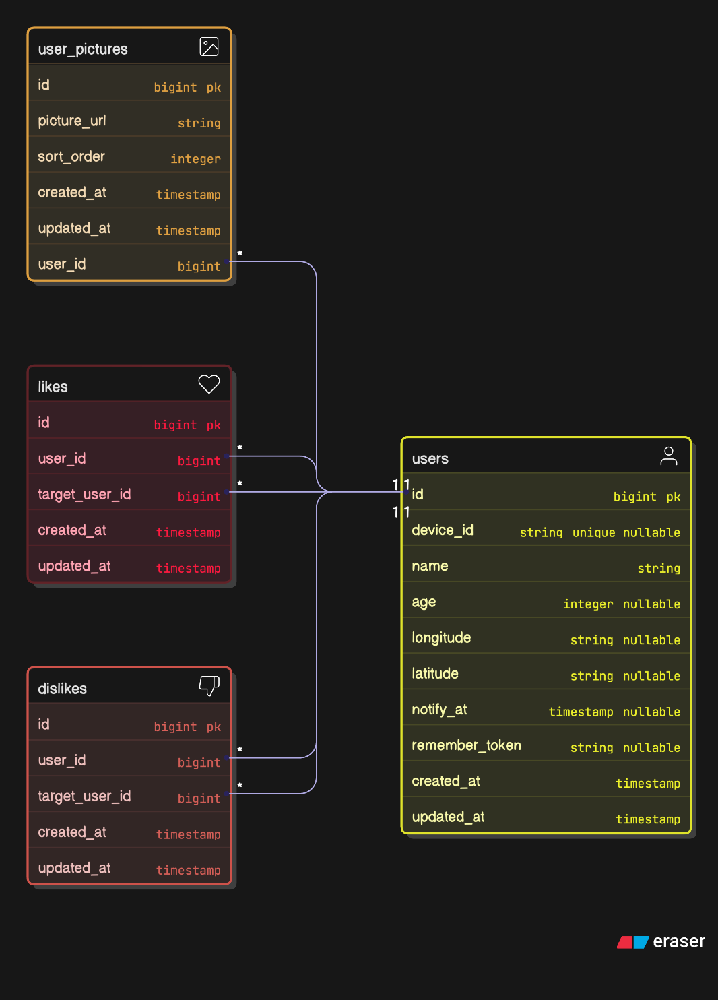

# Hyperhire Tinder API

API backend untuk aplikasi dating/matchmaking berbasis lokasi yang dibangun dengan Laravel 12. API ini menyediakan fitur rekomendasi orang berdasarkan lokasi, sistem like/dislike, dan notifikasi untuk popular people.

## 📋 Daftar Isi

- [Fitur](#-fitur)
- [Persyaratan Sistem](#-persyaratan-sistem)
- [Instalasi](#-instalasi)
- [Konfigurasi](#-konfigurasi)
- [Penggunaan](#-penggunaan)
- [API Endpoints](#-api-endpoints)
- [Dokumentasi API](#-dokumentasi-api)
- [Command & Scheduler](#-command--scheduler)
- [Deployment](#-deployment)
- [Testing](#-testing)
- [Teknologi yang Digunakan](#-teknologi-yang-digunakan)
- [ERD (Entity Relationship Diagram)](#-erd-entity-relationship-diagram)

## ✨ Fitur

- **Rekomendasi Berbasis Lokasi**: Mendapatkan rekomendasi orang berdasarkan jarak dari koordinat latitude/longitude menggunakan algoritma Haversine formula
- **Sistem Like/Dislike**: Fitur untuk menyukai atau tidak menyukai seseorang
- **Daftar Orang yang Menyukai**: Melihat daftar orang yang telah menyukai user tertentu
- **Popular People Detection**: Command otomatis untuk mendeteksi user yang mendapat lebih dari 50 likes dan mengirim notifikasi email
- **Device ID Authentication**: Sistem autentikasi berbasis Device ID
- **API Documentation**: Dokumentasi API lengkap menggunakan Swagger/OpenAPI

## 🔧 Persyaratan Sistem

- PHP >= 8.2
- Composer
- Node.js & NPM
- PostgreSQL atau MySQL
- Extension PHP: `pdo_mysql`, `pdo_pgsql`, `mbstring`, `exif`, `pcntl`, `bcmath`, `gd`, `zip`

## 🚀 Instalasi

1. **Clone repository**
```bash
git clone <repository-url>
cd hyperhire-tinder-api
```

2. **Install dependencies**
```bash
composer install
npm install
```

3. **Setup environment**
```bash
cp .env.example .env
php artisan key:generate
```

4. **Konfigurasi database di `.env`**
```env
DB_CONNECTION=pgsql
DB_HOST=127.0.0.1
DB_PORT=5432
DB_DATABASE=hyperhire_tinder
DB_USERNAME=your_username
DB_PASSWORD=your_password
```

5. **Jalankan migration**
```bash
php artisan migrate
```

6. **Build assets**
```bash
npm run build
```

Atau gunakan script setup otomatis:
```bash
composer run setup
```

## ⚙️ Konfigurasi

### Environment Variables

Pastikan file `.env` sudah dikonfigurasi dengan benar:

```env
# Database
DB_CONNECTION=pgsql
DB_HOST=127.0.0.1
DB_PORT=5432
DB_DATABASE=your_database
DB_USERNAME=your_username
DB_PASSWORD=your_password

# Mail Configuration (untuk popular people notification)
MAIL_MAILER=smtp
MAIL_HOST=smtp.mailtrap.io
MAIL_PORT=2525
MAIL_USERNAME=your_username
MAIL_PASSWORD=your_password
MAIL_ENCRYPTION=tls
MAIL_FROM_ADDRESS=noreply@example.com
MAIL_FROM_NAME="${APP_NAME}"

# Email untuk menerima notifikasi popular people
MAIL_TO_ADDRESS=admin@example.com
```

### Generate API Documentation

Setelah melakukan perubahan pada API, generate ulang dokumentasi Swagger:

```bash
php artisan l5-swagger:generate
```

## 💻 Penggunaan

### Development Mode

Jalankan aplikasi dalam mode development:

```bash
composer run dev
```

Command ini akan menjalankan:
- Laravel development server
- Queue worker
- Log viewer (Pail)
- Vite dev server

### Production Mode

```bash
php artisan serve
```

## 📡 API Endpoints

### Base URL
```
/api/v1
```

### Endpoints

#### 1. Get Recommended People
```
GET /api/v1/people/recommended
```

**Query Parameters:**
- `lat` (required): Latitude
- `lng` (required): Longitude
- `page` (optional): Page number (default: 1)
- `limit` (optional): Items per page (default: 20)

**Response:**
```json
{
  "items": [
    {
      "id": 1,
      "name": "John Doe",
      "age": 25,
      "pictures": ["url1", "url2"],
      "distance_km": 1.2
    }
  ],
  "meta": {
    "page": 1,
    "limit": 20,
    "total": 100,
    "total_page": 5
  }
}
```

#### 2. Like a Person
```
POST /api/v1/people/{user_id}/like
```

**Headers:**
- `X-Device-ID`: Device ID untuk autentikasi

**Body:**
```json
{
  "device_id": "device-12345"
}
```

#### 3. Dislike a Person
```
POST /api/v1/people/{user_id}/dislike
```

**Headers:**
- `X-Device-ID`: Device ID untuk autentikasi

**Body:**
```json
{
  "device_id": "device-12345"
}
```

#### 4. Get Liked List
```
GET /api/v1/people/{user_id}/liked-list
```

**Query Parameters:**
- `page` (optional): Page number (default: 1)
- `limit` (optional): Items per page (default: 20)

**Response:**
```json
{
  "items": [
    {
      "person_id": 2,
      "name": "Jane Doe",
      "age": 23,
      "pictures": ["url1", "url2"],
      "liked_at": "2025-12-05 08:39:39"
    }
  ],
  "meta": {
    "page": 1,
    "limit": 20,
    "total": 50,
    "total_page": 3
  }
}
```

## 📚 Dokumentasi API

Dokumentasi API lengkap tersedia melalui Swagger UI setelah aplikasi berjalan:

```
http://localhost:8000/api/documentation
```

Atau jika menggunakan port custom:
```
http://localhost:{PORT}/api/documentation
```

## 🔄 Command & Scheduler

### Check Popular People

Command untuk mengecek user yang mendapat lebih dari 50 likes dan mengirim email notifikasi:

```bash
php artisan people:check-popular
```

### Scheduled Task

Command ini dijadwalkan untuk berjalan setiap menit melalui Laravel Scheduler. Pastikan scheduler berjalan dengan menambahkan cron job:

```bash
* * * * * cd /path-to-your-project && php artisan schedule:run >> /dev/null 2>&1
```

Atau jika menggunakan Railway atau platform yang mendukung, gunakan script `run-cron.sh` yang sudah tersedia.

## 🐳 Deployment

### Docker

Project ini sudah dilengkapi dengan Dockerfile untuk deployment:

```bash
docker build -t hyperhire-tinder-api .
docker run -p 8080:8080 hyperhire-tinder-api
```

### Railway

Project ini siap untuk deployment di Railway. Pastikan environment variables sudah dikonfigurasi dengan benar di Railway dashboard.

## 🧪 Testing

Jalankan test suite:

```bash
composer run test
```

Atau menggunakan Pest langsung:

```bash
php artisan test
```

## 🛠 Teknologi yang Digunakan

- **Framework**: Laravel 12
- **PHP**: 8.2+
- **Database**: PostgreSQL / MySQL
- **API Documentation**: L5-Swagger (OpenAPI/Swagger)
- **Testing**: Pest PHP
- **Code Style**: Laravel Pint
- **Container**: Docker
- **Node.js**: Untuk build assets (Vite)

## 📝 Struktur Project

```
hyperhire-tinder-api/
├── app/
│   ├── Console/
│   │   └── Commands/
│   │       └── CheckPopularPeople.php
│   ├── Http/
│   │   ├── Controllers/
│   │   │   └── Api/
│   │   │       ├── LikeDislikeController.php
│   │   │       └── RecommendedPeopleController.php
│   │   ├── Middleware/
│   │   ├── Requests/
│   │   └── Resources/
│   ├── Mail/
│   │   └── PopularPersonMail.php
│   ├── Models/
│   │   ├── User.php
│   │   ├── Like.php
│   │   ├── Dislike.php
│   │   └── UserPicture.php
│   └── Services/
│       ├── LikeDislikeService.php
│       └── RecommendedPeopleService.php
├── database/
│   ├── migrations/
│   └── seeders/
├── routes/
│   ├── api.php
│   └── console.php
└── docker/
    └── php.ini
```

## 🗄 ERD (Entity Relationship Diagram)

Diagram Entity Relationship (ERD) berikut menunjukkan struktur database dan relasi antar tabel dalam aplikasi:



### Deskripsi Tabel

#### Users
Tabel utama untuk menyimpan data pengguna aplikasi.
- `id`: Primary key
- `device_id`: Unique identifier untuk device pengguna
- `name`: Nama pengguna
- `age`: Usia pengguna
- `latitude`: Koordinat latitude untuk rekomendasi berbasis lokasi
- `longitude`: Koordinat longitude untuk rekomendasi berbasis lokasi
- `notify_at`: Timestamp terakhir kali notifikasi popular people dikirim
- `created_at`, `updated_at`: Timestamps

#### User Pictures
Tabel untuk menyimpan foto-foto pengguna.
- `id`: Primary key
- `user_id`: Foreign key ke tabel `users`
- `picture_url`: URL gambar pengguna
- `sort_order`: Urutan tampilan gambar
- `created_at`, `updated_at`: Timestamps

#### Likes
Tabel untuk menyimpan data like antar pengguna.
- `id`: Primary key
- `user_id`: Foreign key ke tabel `users` (user yang melakukan like)
- `target_user_id`: Foreign key ke tabel `users` (user yang di-like)
- `created_at`, `updated_at`: Timestamps

#### Dislikes
Tabel untuk menyimpan data dislike antar pengguna.
- `id`: Primary key
- `user_id`: Foreign key ke tabel `users` (user yang melakukan dislike)
- `target_user_id`: Foreign key ke tabel `users` (user yang di-dislike)
- `created_at`, `updated_at`: Timestamps

### Relasi Antar Tabel

- **Users ↔ User Pictures**: One-to-Many (satu user dapat memiliki banyak foto)
- **Users ↔ Likes**: One-to-Many (satu user dapat melakukan banyak like)
- **Users ↔ Dislikes**: One-to-Many (satu user dapat melakukan banyak dislike)
- **Users ↔ Likes (as target)**: One-to-Many (satu user dapat menerima banyak like)

## 📄 License

MIT License

## 👥 Kontribusi

Silakan buat issue atau pull request jika ingin berkontribusi pada project ini.

## 📧 Support

Untuk pertanyaan atau dukungan, silakan buat issue di repository ini.
